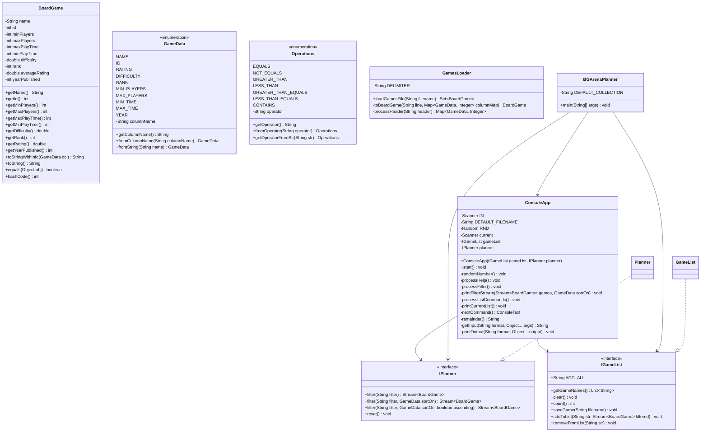
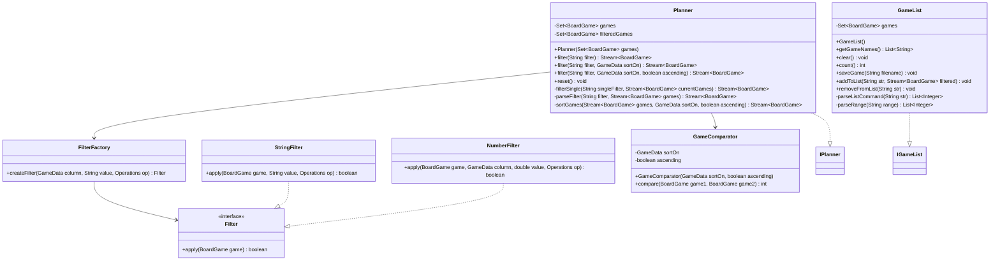

# Board Game Arena Planner Design Document


This document is meant to provide a tool for you to demonstrate the design process. You need to work on this before you code, and after have a finished product. That way you can compare the changes, and changes in design are normal as you work through a project. It is contrary to popular belief, but we are not perfect our first attempt. We need to iterate on our designs to make them better. This document is a tool to help you do that.


## (INITIAL DESIGN): Class Diagram 

Place your class diagrams below. Make sure you check the file in the browser on github.com to make sure it is rendering correctly. If it is not, you will need to fix it. As a reminder, here is a link to tools that can help you create a class diagram: [Class Resources: Class Design Tools](https://github.com/CS5004-khoury-lionelle/Resources?tab=readme-ov-file#uml-design-tools)

### Provided Code

Provide a class diagram for the provided code as you read through it.  For the classes you are adding, you will create them as a separate diagram, so for now, you can just point towards the interfaces for the provided code diagram.



### Your Plans/Design

Create a class diagram for the classes you plan to create. This is your initial design, and it is okay if it changes. Your starting points are the interfaces. 




## (INITIAL DESIGN): Tests to Write - Brainstorm

Write a test (in english) that you can picture for the class diagram you have created. This is the brainstorming stage in the TDD process. 

> [!TIP]
> As a reminder, this is the TDD process we are following:
> 1. Figure out a number of tests by brainstorming (this step)
> 2. Write **one** test
> 3. Write **just enough** code to make that test pass
> 4. Refactor/update  as you go along
> 5. Repeat steps 2-4 until you have all the tests passing/fully built program

You should feel free to number your brainstorm.
1. Test that Planner can be initialized with a set of BoardGames
2. Test that Planner.reset() returns all the games that were initially provided
3. Test that Planner.filter() with an empty string returns all games sorted by name
4. Test that Planner.filter() with "name==GameName" returns only games with that exact name
5. Test that Planner.filter() with "name~=partial" returns games that contain that substring in their name
6. Test that Planner.filter() with "minPlayers>3" filters games correctly
7. Test that Planner.filter() with "maxPlayers<6" filters games correctly
8. Test that Planner.filter() with "minPlayers>3,maxPlayers<6" filters games correctly (multiple filters)
9. Test that Planner.filter() with sorting parameter works correctly
10. Test that Planner.filter() with descending order works correctly
11. Test that GameList can be initialized
12. Test that GameList.count() returns 0 when empty
13. Test that GameList.getGameNames() returns empty list when empty
14. Test that GameList.addToList() with a specific game name adds that game
15. Test that GameList.addToList() with a number adds the proper game from the filtered stream
16. Test that GameList.addToList() with a range "1-3" adds games 1, 2, and 3 from the filtered stream
17. Test that GameList.addToList() with "all" adds all games from the filtered stream
18. Test that GameList.removeFromList() with a specific game name removes that game
19. Test that GameList.removeFromList() with a number removes the proper game
20. Test that GameList.removeFromList() with a range "1-3" removes games 1, 2, and 3
21. Test that GameList.removeFromList() with "all" clears the list
22. Test that GameList.clear() empties the list
23. Test that GameList.saveGame() writes the correct content to a file
24. Test that StringFilter correctly applies the EQUALS operator
25. Test that StringFilter correctly applies the CONTAINS operator
26. Test that NumberFilter correctly applies all numeric operators (>, <, >=, <=, ==, !=)
27. Test that FilterFactory creates the correct type of filter based on the column type
28. Test that GameComparator sorts games correctly by different columns
29. Test that GameComparator sorts games in ascending and descending order


## (FINAL DESIGN): Class Diagram

Go through your completed code, and update your class diagram to reflect the final design. Make sure you check the file in the browser on github.com to make sure it is rendering correctly. It is normal that the two diagrams don't match! Rarely (though possible) is your initial design perfect. 

For the final design, you just need to do a single diagram that includes both the original classes and the classes you added. 

> [!WARNING]
> If you resubmit your assignment for manual grading, this is a section that often needs updating. You should double check with every resubmit to make sure it is up to date.


## (FINAL DESIGN): Reflection/Retrospective

```mermaid
classDiagram
    class BoardGame {
        -String name
        -int id
        -int minPlayers
        -int maxPlayers
        -int maxPlayTime
        -int minPlayTime
        -double difficulty
        -int rank
        -double averageRating
        -int yearPublished
        +getName() String
        +getId() int
        +getMinPlayers() int
        +getMaxPlayers() int
        +getMaxPlayTime() int
        +getMinPlayTime() int
        +getDifficulty() double
        +getRank() int
        +getRating() double
        +getYearPublished() int
        +toStringWithInfo(GameData) String
        +equals(Object) boolean
        +hashCode() int
    }

    class IPlanner {
        <<interface>>
        +filter(String) Stream~BoardGame~
        +filter(String, GameData) Stream~BoardGame~
        +filter(String, GameData, boolean) Stream~BoardGame~
        +reset() void
    }

    class Planner {
        -Set~BoardGame~ allGames
        -List~BoardGame~ currentFilteredGames
        -static String FILTER_SEPARATOR
        +Planner(Set~BoardGame~)
        +filter(String) Stream~BoardGame~
        +filter(String, GameData) Stream~BoardGame~
        +filter(String, GameData, boolean) Stream~BoardGame~
        +reset() void
        -applyFilter(Stream~BoardGame~, String) Stream~BoardGame~
        -matchesFilter(BoardGame, GameData, Operations, String) boolean
        -matchesStringFilter(String, Operations, String) boolean
        -matchesNumericFilter(double, Operations, String) boolean
        -matchesNumericFilter(int, Operations, String) boolean
        -sortGames(Stream~BoardGame~, GameData, boolean) Stream~BoardGame~
        -createComparator(GameData, boolean) Comparator~BoardGame~
    }

    class IGameList {
        <<interface>>
        +static String ADD_ALL
        +getGameNames() List~String~
        +clear() void
        +count() int
        +saveGame(String) void
        +addToList(String, Stream~BoardGame~) void
        +removeFromList(String) void
    }

    class GameList {
        -Set~String~ gameNames
        -static String RANGE_SEPARATOR
        +GameList()
        +getGameNames() List~String~
        +clear() void
        +count() int
        +saveGame(String) void
        +addToList(String, Stream~BoardGame~) void
        +removeFromList(String) void
        -addByRange(String, List~BoardGame~) void
        -addByIndex(int, List~BoardGame~) void
        -removeByRange(String, List~String~) void
        -removeByIndex(int, List~String~) void
    }

    class GameData {
        <<enumeration>>
        NAME
        ID
        RATING
        DIFFICULTY
        RANK
        MIN_PLAYERS
        MAX_PLAYERS
        MIN_TIME
        MAX_TIME
        YEAR
        -String columnName
        +getColumnName() String
        +static fromColumnName(String) GameData
        +static fromString(String) GameData
    }

    class Operations {
        <<enumeration>>
        EQUALS
        NOT_EQUALS
        GREATER_THAN
        LESS_THAN
        GREATER_THAN_EQUALS
        LESS_THAN_EQUALS
        CONTAINS
        -String operator
        +getOperator() String
        +static fromOperator(String) Operations
        +static getOperatorFromStr(String) Operations
    }

    class FilterHandler {
        <<utility>>
        -FilterHandler() 
        +static createFilter(GameData, Operations, String) Predicate~BoardGame~
        -static createStringFilter(Function, Operations, String) Predicate~BoardGame~
        -static createIntFilter(ToIntFunction, Operations, String) Predicate~BoardGame~
        -static createDoubleFilter(ToDoubleFunction, Operations, String) Predicate~BoardGame~
        +static parseFilterExpression(String) FilterComponents
    }

    class FilterHandler {
        -GameData column
        -Operations operator
        -String value
        +FilterComponents(GameData, Operations, String)
        +getColumn() GameData
        +getOperator() Operations
        +getValue() String
    }

    class SortComparator {
        <<utility>>
        -SortComparator()
        +static createComparator(GameData, boolean) Comparator~BoardGame~
        -static getColumnComparator(GameData) Comparator~BoardGame~
        +static nameComparator() Comparator~String~
    }

    class GamesLoader {
        <<utility>>
        -static String DELIMITER
        -GamesLoader()
        +static loadGamesFile(String) Set~BoardGame~
        -static toBoardGame(String, Map) BoardGame
        -static processHeader(String) Map
    }

    class ConsoleApp {
        -static Scanner IN
        -static String DEFAULT_FILENAME
        -static Random RND
        -Scanner current
        -IGameList gameList
        -IPlanner planner
        +ConsoleApp(IGameList, IPlanner)
        +start() void
        -randomNumber() void
        -processHelp() void
        -processFilter() void
        -static printFilterStream(Stream~BoardGame~, GameData) void
        -processListCommands() void
        -printCurrentList() void
        -nextCommand() ConsoleText
        -remainder() String
        -static getInput(String, Object...) String
        -static printOutput(String, Object...) void
    }

    class BGArenaPlanner {
        <<main>>
        -static String DEFAULT_COLLECTION
        -BGArenaPlanner()
        +static main(String[]) void
    }

    IPlanner <|.. Planner
    IGameList <|.. GameList
    Planner --> BoardGame
    Planner --> GameData
    Planner --> Operations
    Planner ..> SortComparator : uses
    GameList --> BoardGame
    FilterHandler --> GameData
    FilterHandler --> Operations
    FilterHandler +-- FilterHandler.FilterComponents
    GamesLoader --> BoardGame
    GamesLoader --> GameData
    ConsoleApp --> IGameList
    ConsoleApp --> IPlanner
    BGArenaPlanner ..> GamesLoader : uses
    BGArenaPlanner ..> IPlanner : creates
    BGArenaPlanner ..> IGameList : creates
    BGArenaPlanner ..> ConsoleApp : creates
```

> [!IMPORTANT]
> The value of reflective writing has been highly researched and documented within computer science, from learning to information to showing higher salaries in the workplace. For this next part, we encourage you to take time, and truly focus on your retrospective.

Take time to reflect on how your design has changed. Write in *prose* (i.e. do not bullet point your answers - it matters in how our brain processes the information). Make sure to include what were some major changes, and why you made them. What did you learn from this process? What would you do differently next time? What was the most challenging part of this process? For most students, it will be a paragraph or two.

Initially, I planned for multiple filter classes with a factory pattern, but I found this approach too complex. Instead, I used utility classes with static methods that handle filtering and sorting more simply. The hardest part was parsing filter strings correctly, especially with multiple conditions. I learned that Java streams are powerful for filtering, though they have a learning curve. Next time, I'd spend more time planning the string parsing before coding to avoid extensive refactoring later.